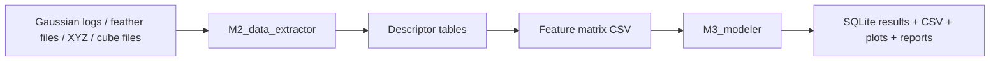
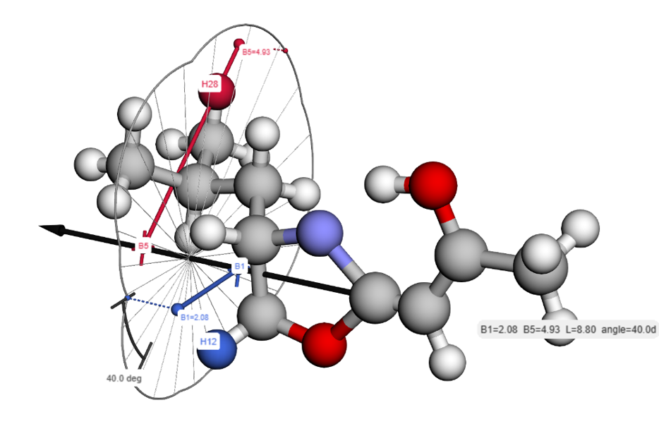
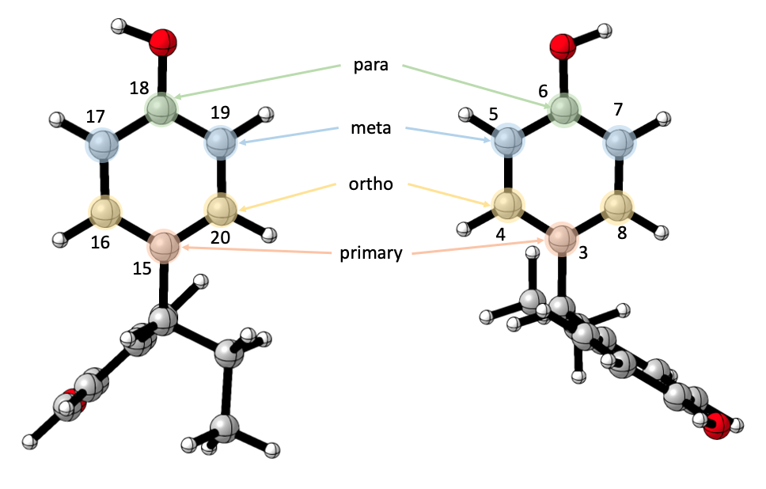
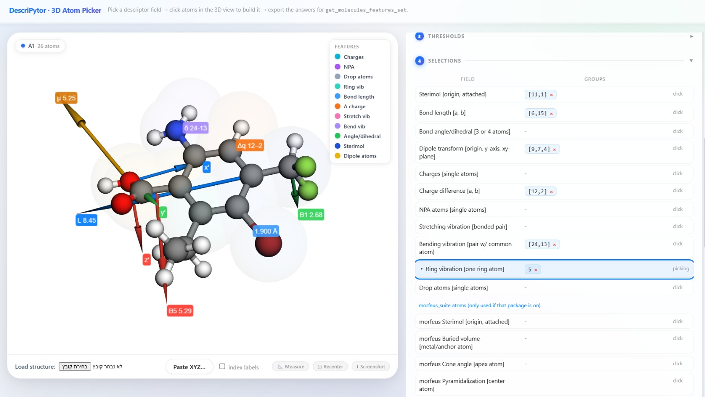
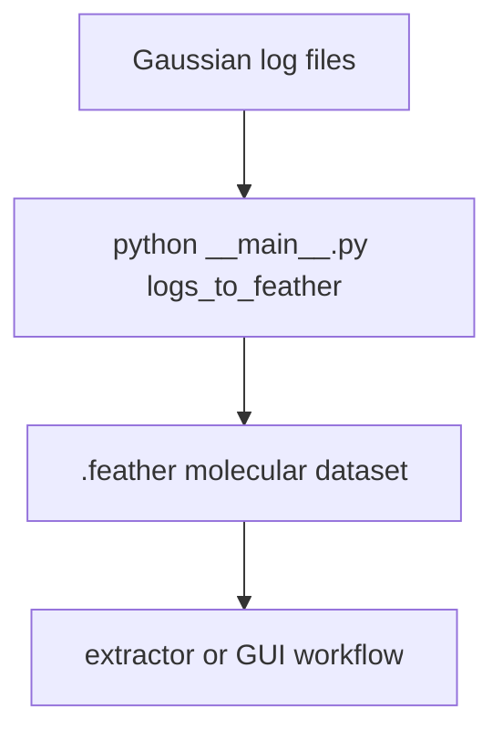
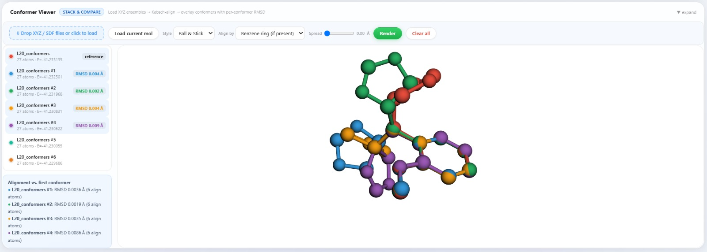

# DescriPyTor Tutorial

This tutorial is a guided path through the most common DescriPyTor workflow:

1. prepare molecular data
2. extract descriptors
3. assemble a feature matrix
4. run regression or classification
5. inspect and reuse the saved results

If you want the short version, read the [README](../../README.md).

## Workflow at a glance



## What each module does

| Module | Role | Typical output |
| --- | --- | --- |
| `M1_pre_calculations` | Prepare external calculation inputs | input files and submission helpers |
| `M2_data_extractor` | Turn molecular files into descriptors | feature tables |
| `M3_modeler` | Search and evaluate models | ranked models, metrics, plots |
| `MolAlign` | Alignment and renumbering utilities | aligned structures and helper outputs |

## Visual cues

Sterimol and ring-style descriptors are central ideas in the extractor layer, so here are two visuals already present in the repository:





## Path 1: start from feather files

This is the smoothest route when your molecular data has already been converted into `.feather` files.

### Step 1. Launch the GUI

```bash
python __main__.py gui
```

Use the GUI when you want to:

- inspect molecules before extracting descriptors
- choose atoms interactively
- save the extraction setup as JSON
- test several descriptor families quickly

Atom picking in the GUI:



### Step 2. Reuse a saved extraction config

The repository already includes a small example:

```bash
python __main__.py extractor \
  --input Getting_started_with_examples/feather_example/input_example.json \
  --output feature_set \
  --feather_directory Getting_started_with_examples/feather_example
```

Outputs typically include:

- a feature matrix CSV
- optional correlation summaries
- any plots configured by the extraction path

## Path 2: convert Gaussian logs first

If your raw inputs are Gaussian log files, convert them before feature extraction.



Run:

```bash
python __main__.py logs_to_feather
```

The command prompts for the directory containing log files and writes feather outputs for downstream extraction.

## Descriptor extraction in Python

If you prefer scripting instead of the GUI, follow the same pattern used in `Getting_started_with_examples/Practical_Notebook_Features.ipynb`:

```python
import os
import sys

ROOT_DIR = r"path	o\DescriPyTor"   # or leave unset and rely on DESCRIPYTOR_ROOT
sys.path.append(ROOT_DIR)
sys.path.append(os.path.join(ROOT_DIR, "M2_data_extractor"))
os.chdir(ROOT_DIR)

from data_extractor import Molecules

feather_path = os.path.join(ROOT_DIR, "Getting_started_with_examples", "feather_example")
mols = Molecules(feather_path)

# first inspect a structure, then build descriptor inputs
mols.visualize_molecules([0])
```

Once your atom selections are defined, the notebook workflow uses `get_molecules_features_set(...)` to save a feature matrix and correlation table.

## Conformer comparison and visual inspection

DescriPyTor also includes viewer-oriented utilities for comparing related structures and checking how conformers align in 3D. That is especially helpful when you are validating atom numbering, ring alignment, or ensemble consistency before extracting descriptors.

Conformer comparison view:



## Modeling workflow

Once you have a feature matrix, the modeling layer can search feature combinations and rank models by performance.


### Regression example

The modeling notebook uses a one-CSV setup and instantiates `LinearRegressionModel` directly. A repo-local example looks like this:

```python
import os
import sys

ROOT_DIR = r"path	o\DescriPyTor"   # or leave unset and rely on DESCRIPYTOR_ROOT
sys.path.append(ROOT_DIR)
sys.path.append(os.path.join(ROOT_DIR, "M3_modeler"))
os.chdir(ROOT_DIR)

from modeling import LinearRegressionModel

csv_path = os.path.join(
    ROOT_DIR,
    "Getting_started_with_examples",
    "modeling_example",
    "Linear_Dataset_Example.csv",
)

csv_filepaths = {
    "features_csv_filepath": csv_path,
    "target_csv_filepath": "",
}

regression_model = LinearRegressionModel(
    csv_filepaths,
    process_method="one csv",
    y_value="output",
    leave_out=[],
    min_features_num=2,
    max_features_num=3,
)

results = regression_model.search_models(top_n=20, threshold=0.70, n_jobs=16)
```

The equivalent CLI form is:

```bash
python __main__.py model \
  --mode regression \
  --features_csv Getting_started_with_examples/modeling_example/Linear_Dataset_Example.csv \
  --y_value output \
  --min-features 2 \
  --max-features 3 \
  --top-n 20 \
  --threshold 0.70 \
  --n_jobs 16
```

### Classification example

```bash
python __main__.py model \
  --mode classification \
  --features_csv Getting_started_with_examples/modeling_example/Logistic_Dataset_Example.csv \
  --y_value class \
  --min-features 2 \
  --max-features 4 \
  --top-n 20 \
  --threshold 0.50 \
  --n_jobs 16
```

## Parallel modeling note

For large regression searches, `--n_jobs` is the main control for parallelism.

Practical guidance:

- on a 20-core machine, start with `--n_jobs 16`
- move to `18` if memory usage stays comfortable
- use `20` only if the machine remains responsive and the dataset is not memory-heavy

Large searches may still take time because feature-combination counts grow very quickly.

## Example notebooks

The best hands-on examples are already in the repository:

- [Getting_started_with_examples/Practical_Notebook_Features.ipynb](../Practical_Notebook_Features.ipynb)
- [Getting_started_with_examples/Practical_Notebook_Modeling.ipynb](../Practical_Notebook_Modeling.ipynb)
- [Getting_started_with_examples/modeling_example/Linear_Dataset_Example.csv](../modeling_example/Linear_Dataset_Example.csv)
- [Getting_started_with_examples/modeling_example/Logistic_Dataset_Example.csv](../modeling_example/Logistic_Dataset_Example.csv)

## Troubleshooting

### The CLI help fails before showing usage

Check that your environment satisfies the pinned dependencies and that the scientific stack is installed correctly.

### Feature extraction fails on some molecules

Some batch extractors skip failures and continue. Start with a smaller example set to verify atom indexing and descriptor definitions.

### Parallel model search still feels slow

That usually means one of these:

- the feature search space is huge
- the descriptors are expensive to evaluate
- the machine is memory-bound

Try lowering `--max-features`, raising the threshold, or running a smaller benchmark first.

## Suggested first session

If you are opening DescriPyTor for the first time, this is a good order:

1. Run `python __main__.py --help`
2. Open `Getting_started_with_examples/README.md`
3. Launch `python __main__.py gui`
4. Run the extractor example on `Getting_started_with_examples/feather_example`
5. Run a small regression search with a conservative `--max-features`

That sequence gives you a feel for the whole stack without throwing you into a multi-million-combination model search on day one.
