# The Sterimol θ explorer: a manual

The explorer draws every Sterimol, dipole, charge, cone-angle and buried-volume construction on the
molecule itself, so you can see where a number comes from, change the atoms it is read at, and export
the result as a figure. It is one web page; nothing is uploaded anywhere.

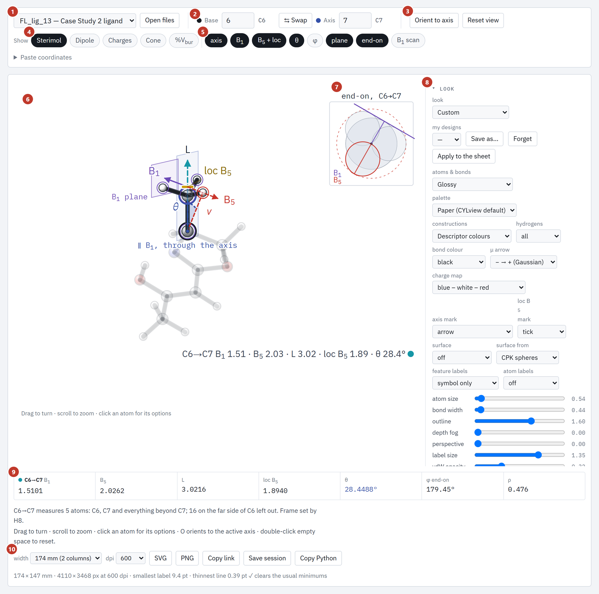

**What you can do with it**

| I want to… | go to |
|---|---|
| open it | [1. Start it](#1-start-it) |
| learn what is on the screen | [2. The screen](#2-the-screen) |
| read B₁, B₅, L, loc B₅ and θ off a molecule | [3. Reading the drawing](#3-reading-the-drawing) |
| measure another bond or atom pair | [4. Choosing the axis](#4-choosing-the-axis) |
| show the dipole, charges, cone angle or %V_bur | [6. The Show chips](#6-the-show-chips) |
| see how sharp a B₁ minimum is | [7. The B₁ scan](#7-the-b1-scan) |
| compare several structures | [9. Stacking structures](#9-stacking-structures) |
| make a figure for a paper | [10. Making a figure](#10-making-a-figure) |
| load my own molecule | [11. Your own molecules](#11-your-own-molecules) |
| check the numbers against the package | [12. Checking the numbers](#12-checking-the-numbers) |

- [1. Start it](#1-start-it)
- [2. The screen](#2-the-screen)
- [3. Reading the drawing](#3-reading-the-drawing)
- [4. Choosing the axis](#4-choosing-the-axis)
- [5. Clicking an atom](#5-clicking-an-atom)
- [6. The Show chips](#6-the-show-chips)
- [7. The B₁ scan](#7-the-b1-scan)
- [8. The side panel](#8-the-side-panel)
- [9. Stacking structures](#9-stacking-structures)
- [10. Making a figure](#10-making-a-figure)
- [11. Your own molecules](#11-your-own-molecules)
- [12. Checking the numbers](#12-checking-the-numbers)
- [13. Known differences from the package](#13-known-differences-from-the-package)
- [14. Keyboard, mouse and URL reference](#14-keyboard-mouse-and-url-reference)
- [15. Regenerating the screenshots](#15-regenerating-the-screenshots)

Atom numbers are **1-based**, as in Gaussian, throughout.

## 1. Start it

**From the package (recommended).**

```bash
descripytor visual                 # then open http://127.0.0.1:7432/theta
```

This serves the page from the Flask server, and the page then compares its numbers with the
package's Python on every pick ([section 12](#12-checking-the-numbers)). Inside the atom picker
(`/visual`) the explorer runs embedded, with a **Use in Sterimol ↗** button that sends the active
base → axis pair back as a Sterimol selection.

**As a plain page.** `M2_data_extractor/theta_explorer/theta_explorer.html` is a single built file. It
needs no server of its own, but serve it rather than double-clicking it: the substructure matcher
loads RDKit files that browsers restrict on `file://` pages.

```bash
python -m http.server 8742 --directory M2_data_extractor/theta_explorer
# open http://localhost:8742/theta_explorer.html
```

Without the Flask server there is no live check against the Python; everything else works.

The page opens on a built-in structure. Add `?mol=<name>` to open another one, for example
`theta_explorer.html?mol=FL_lig_13`; the full list of parameters is in [section 14](#14-keyboard-mouse-and-url-reference).

## 2. The screen

The numbers below are the numbers in the picture at the top of this page.

1. **Molecule menu.** 38 built-in structures: the Case Study 1 substrates (`m-CN`, `p-OTf`, …), the
   Case Study 2 ligands (`FL_lig_*`), the Case Study 3 complexes (`045_lig`, …), bis(oxazoline),
   pyridine-oxazoline and phosphine-oxazoline complexes, and a benzoic-acid series. **Open files**
   loads your own ([section 11](#11-your-own-molecules)).
2. **Base and Axis.** The two atoms that define the Sterimol axis. Type atom numbers, or click atoms
   ([section 5](#5-clicking-an-atom)).
3. **Orient to axis** and **Reset view.**
4. **Show chips.** Which family of constructions is drawn: Sterimol, Dipole, Charges, Cone, %V_bur.
5. **Construction toggles.** Which parts of the Sterimol drawing are drawn: axis, B₁, B₅ + loc, θ, φ,
   plane, end-on, B₁ scan.
6. **The molecule.** Drag to turn it, scroll to zoom, click an atom for its options.
7. **The end-on inset.** The molecule seen down the axis.
8. **The side panel.** Looks, extra axes, substructure search, stacking, dipole frame, charges, cone,
   sheet and figure settings ([section 8](#8-the-side-panel)).
9. **The numbers.** One row per measured axis ([section 3](#3-reading-the-drawing)).
10. **The export row.** SVG, PNG, a link, a session file and the Python that reproduces the numbers
    ([section 10](#10-making-a-figure)).

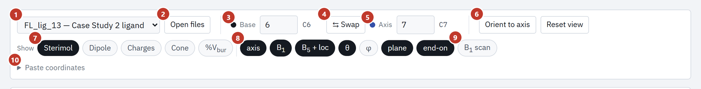

| # | control | what it does |
|---|---|---|
| 1 | molecule menu | switches structure |
| 2 | Open files | loads structures, calculations or a saved session |
| 3 | Base | the atom the axis starts at |
| 4 | Swap | exchanges base and axis (key **S**) |
| 5 | Axis | the atom the axis points to |
| 6 | Orient to axis | turns the molecule the way the θ figure is drawn: axis up, v in front of the B₁ plane (key **O**); next to it, Reset view (**R**) |
| 7 | Show chips | the family of constructions |
| 8 | construction toggles | the parts of the Sterimol drawing |
| 9 | B₁ scan | the profile of B₁ over the rotation scan ([section 7](#7-the-b1-scan)) |
| 10 | Paste coordinates | opens a box for an xyz block ([section 11](#11-your-own-molecules)) |

## 3. Reading the drawing

Open any molecule and pick the preset **theta construction** in the *Figure* section, or add
`&preset=theta%20construction` to the URL. It switches on every part of the Sterimol construction.

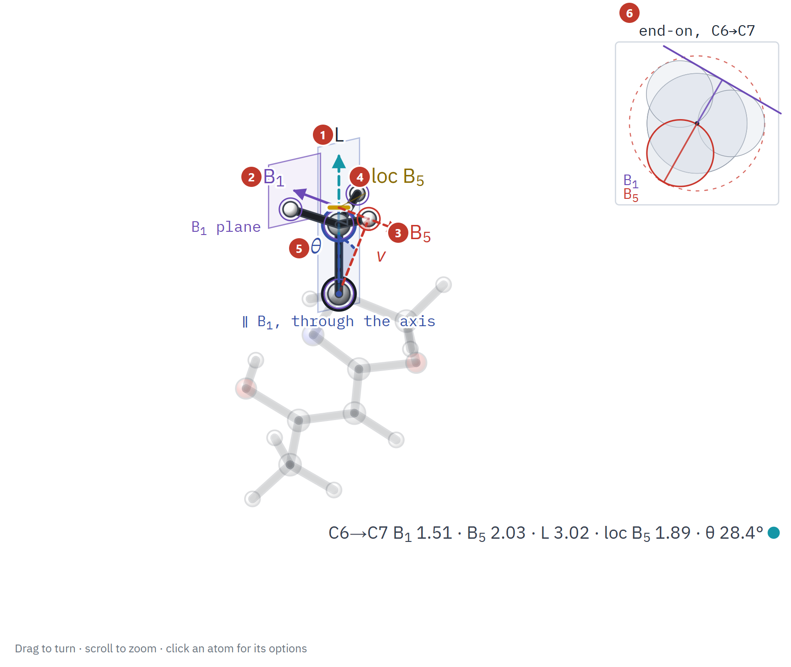

1. **L.** The arrow along the axis: the length of the fragment along it, atom radii included.
2. **B₁ and its plane.** B₁ is the narrowest width of the fragment, measured perpendicular to the
   axis. The purple arrow is B₁, and the small purple plane at its tip is the **B₁ plane**. The large
   pale plane, labelled *∥ B₁, through the axis*, is the same plane moved to pass through the axis.
3. **B₅.** The widest extent, perpendicular to the axis (red arrow), and the atom that sets it
   (circled in red).
4. **loc B₅.** *Where along L* the B₅ atom sits, marked with a short bar on the axis.
5. **θ.** The angle between **v**, the line from the base atom to the B₅ atom (red, dashed), and the
   B₁ plane. θ is 0° when the widest atom lies in the narrowest plane, and grows as the bulk leans out
   of it.
6. **The end-on inset.** The fragment seen down the axis: the circles are the atoms' radii, the
   purple line is the B₁ plane edge-on, and the red circle is the B₅ atom.

Atoms the axis does not measure are drawn faded. The line under the structure repeats the numbers.

**The numbers strip** (9 in the overview) has one row per axis:

| column | meaning |
|---|---|
| B₁ | narrowest width, Å |
| B₅ | widest extent, Å |
| L | length along the axis, Å |
| loc B₅ | position of the B₅ atom along the axis, Å |
| θ | angle between **v** and the B₁ plane, degrees |
| φ end-on | azimuth of B₅ from the B₁ normal, as drawn in the end-on view |
| ρ | the B₅ atom's distance from the axis divided by |**v**|; sin θ = \|cos φ\| · ρ |

Below it the page says what was measured, for example: *"C6→C7 measures 5 atoms: C6, C7 and
everything beyond C7; 16 on the far side of C6 left out. Frame set by H8."* The fragment is the
axis atoms and everything beyond the axis atom; atoms behind the base are not part of it. The
*frame* atom is the third atom that fixes the direction the B₁ scan starts from (it can move B₁ by a
few thousandths of an Å, which is why the page names it).

## 4. Choosing the axis

The axis runs **from the base atom to the axis atom**.

- Type two atom numbers into **Base** and **Axis**. The symbols next to the boxes (`C6`, `C7`) confirm
  which atoms you chose.
- Or click an atom and choose **Make it the base** or **Make it the axis** ([section 5](#5-clicking-an-atom)).
- **Swap** (key **S**) reverses the direction. Measuring C1→C23 and C23→C1 gives different numbers,
  because the fragment is the part beyond the axis atom.
- To measure several axes at once, open **Sterimol axes** in the side panel and press **+ New axis**.
  Each axis gets a row in the numbers strip. In the Case Study 3 complex `045_lig`, the two oxazoline
  arms are two axes.
- **Substructure** finds the same fragment across a series by SMARTS and can send the first atom of
  the match to the axis base or tip ([section 8](#8-the-side-panel)).

## 5. Clicking an atom

Click any atom (or tap it) to open its menu.

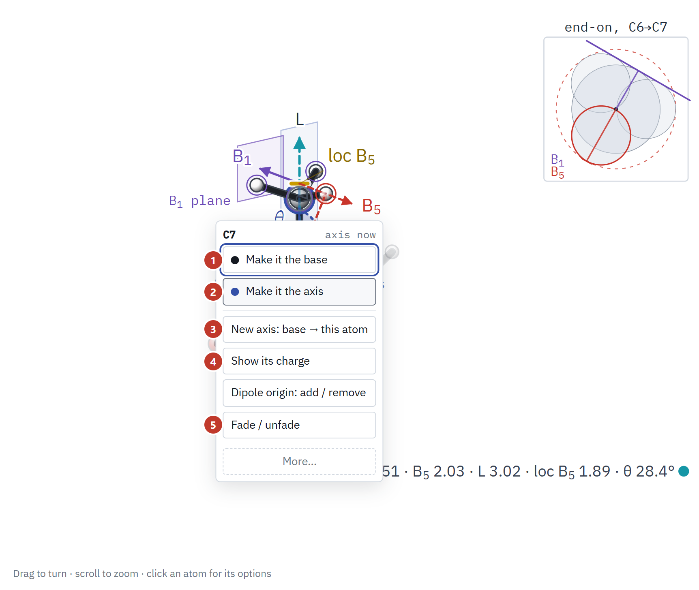

1. **Make it the base** (key **B** while the menu is open).
2. **Make it the axis** (key **A**).
3. **New axis: base → this atom.** Adds a second axis from the current base to this atom.
4. **Show its charge.** Adds a charge site, if the structure has charges.
5. **Fade / unfade.** Draws the atom faint.

**Dipole origin: add / remove** (between 4 and 5) adds the atom to the set whose centroid is the dipole
origin. **More…** has the rest: *Dipole axis û through it*, *Dipole plane through it*, *Align stack on
it: add / remove*, *Put its label back*, *Measure this structure*, *Hide this structure*.

Press **Esc**, or click elsewhere, to close the menu.

## 6. The Show chips

The five chips choose which family of constructions the picture shows.

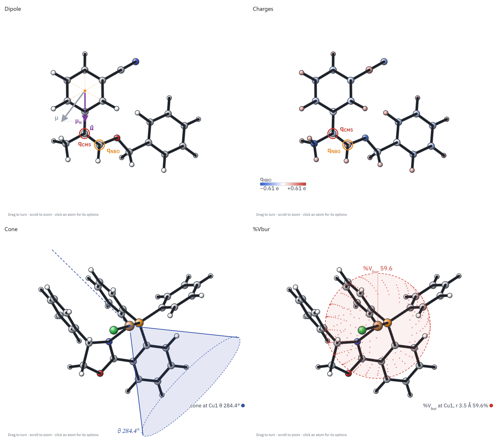

| chip | draws | needs |
|---|---|---|
| **Sterimol** | the axis, B₁ and its plane, B₅, loc B₅, θ, end-on inset | a base and an axis |
| **Dipole** | the dipole vector μ, the frame (û, v̂, ŵ) it is read in, and the projections μ_u, μ_v, μ_w | a dipole from a calculation (`.feather` or Gaussian `.log`), and the frame ([section 8](#8-the-side-panel)) |
| **Charges** | the partial charge at chosen atoms, or every atom coloured by charge | charges from a calculation |
| **Cone** | the exact cone angle from the base atom over every other atom | the base atom as the apex |
| **%V_bur** | the buried-volume sphere of the base atom, with the percentage | the base atom as the centre, and a radius |

An xyz file alone carries no dipole and no charges; the Dipole and Charges chips draw nothing for it.
The built-in Case Study 1 substrates ship with their Gaussian dipoles and charges.

In the Sterimol drawing, each toggle next to the chips switches one part: **axis**, **B₁**,
**B₅ + loc**, **θ**, **φ** (the azimuth, drawn in the end-on view), **plane**, **end-on** and
**B₁ scan**.

## 7. The B1 scan

B₁ is a minimum over the directions the plane can take. Sometimes the minimum is sharp; sometimes
many directions are almost as narrow, and then the plane (and so θ) is not well defined. Switch on
**B₁ scan** to see the width at every rotation.

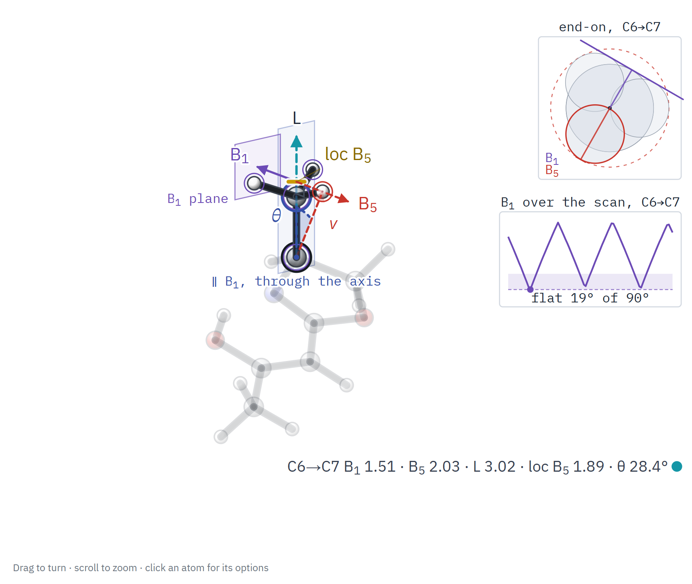

The inset plots B₁ against the rotation of the plane. The shaded band is the part of the rotation
within a small tolerance of the minimum, and the label gives its extent (here *flat 19° of 90°*). A
wide band is a warning: several planes are equally narrow, and a θ read at one of them is arbitrary.
In the **Sterimol axes** section, **▶ Play the scan** sweeps the plane through the rotations the scan
tried and settles on the narrowest.

## 8. The side panel

The side panel collapses into sections. All nine open at once look like this:

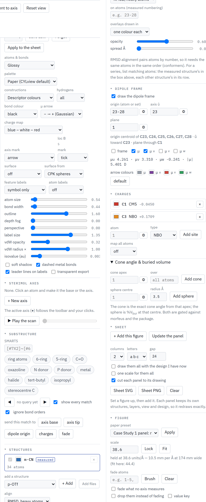

| section | what it holds |
|---|---|
| **Look** | atom and bond style, palette, colours of the constructions, hydrogens, charge colour map, axis and loc B₅ marks, a surface (CPK spheres or a promolecular density), feature labels (*symbol only* or *symbol and value*), atom labels, sliders for atom size, bond width, outline, depth fog, perspective, label size and van der Waals opacity, shadow, leader lines. **my designs** saves a whole look under a name; **Apply to the sheet** draws every panel of the sheet with it. |
| **Sterimol axes** | the list of axes (**+ New axis**), and **▶ Play the scan**. |
| **Substructure** | a SMARTS search (below). |
| **Structures** | stacking more than one structure ([section 9](#9-stacking-structures)). |
| **Dipole frame** | *draw the dipole frame*; the frame's **origin** (an atom, or a set whose centroid is used), **axis û**, and **plane** atom; which of the frame, μ, μ_u, μ_v, μ_w to draw; the arrow colours. Each field has a ◎ button: arm it, then click an atom to fill the field. |
| **Charges** | **atom**, **type** (whichever charge types the file holds) and **Add site**; **map all atoms** colours every atom by charge. |
| **Cone angle & buried volume** | **cone apex** and what it is measured **over**, with **Add cone**; **sphere centre** and **radius Å**, with **Add sphere**. The cone is the exact cone angle from that apex; the sphere is %V_bur. Both are checked against morfeus and the package. |
| **Sheet** | collects several figures into one multi-panel figure ([section 10](#10-making-a-figure)). |
| **Figure** | the paper presets, the drawing scale, fading of atoms, and the value key. |

**Substructure.** Type a SMARTS pattern, or press one of the chips: *ring atoms, 6-ring, 5-ring, C=O,
oxazoline, N donor, P donor, metal, halide, tert-butyl, isopropyl, stereocentre C*. The matches are
highlighted; ◀ ▶ step through them and *show every match* draws them all. Press *ignore bond orders*
to match through aromatic and double bonds alike. A match can be sent to **axis base**, **axis tip**,
**dipole origin**, **charges** or **fade**, which makes the same selection on every molecule in a
series without typing atom numbers.

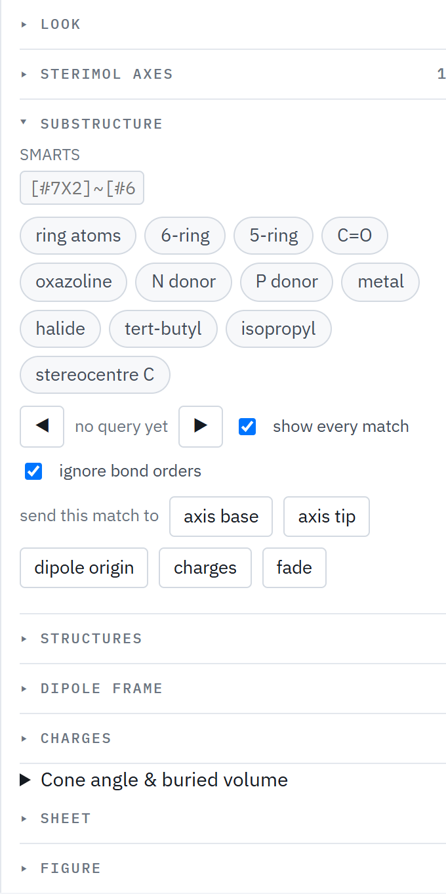

**Figure: fading.** *fade atoms* takes numbers (`1-5, 30`). **Brush** fades atoms as the pointer runs
over them (hold **Alt** to bring them back), **Clear** brings every atom back, *fade what no axis
measures* removes the clutter around a measured fragment, and *drop them instead of fading* removes
those atoms from the drawing.

## 9. Stacking structures

To compare conformers, a series, or a ligand in two complexes, draw several structures on top of one
another, each aligned to the measured one.

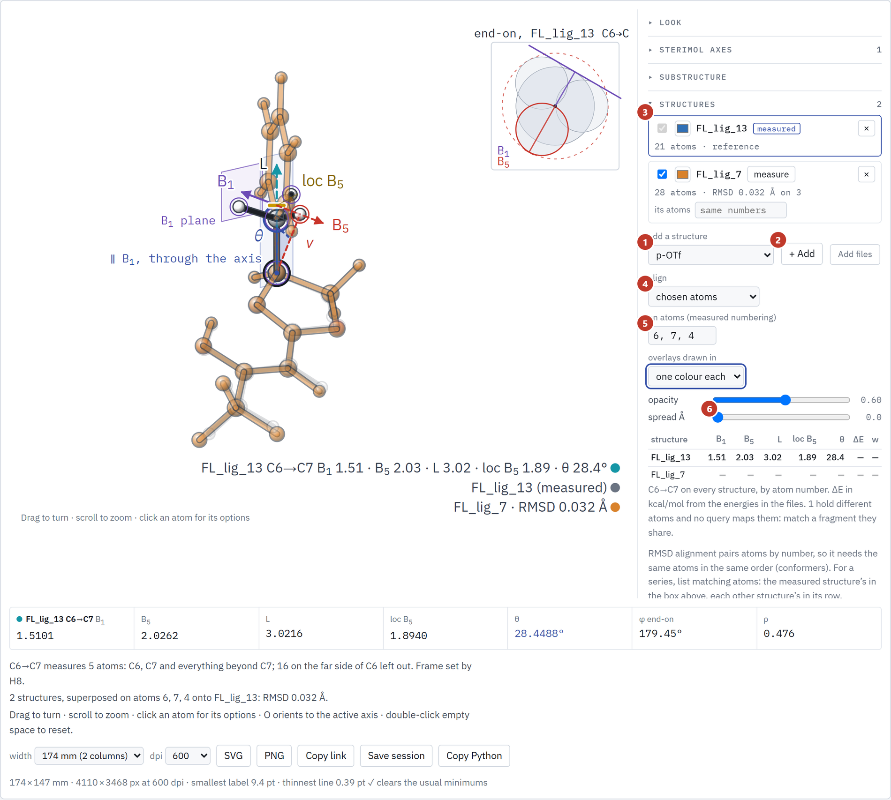

1. **Add a structure.** Pick one in the menu and press **+ Add**, or load files with **Add files**
   (a multi-frame xyz becomes one structure per frame).
2. **The list.** Each row has a visibility box, a colour, the name, a *measure* button that makes
   that structure the measured one, and × to remove it. The line under the name gives the atom count,
   and, once aligned, the RMSD.
3. **Align.** Choose how the structures are superposed:

   | mode | pairs atoms by | use for |
   |---|---|---|
   | RMSD, heavy atoms | number | conformers of one molecule |
   | RMSD, all atoms | number | the same, hydrogens included |
   | chosen atoms | the atoms you list | a series that shares a fragment |
   | substructure match | a SMARTS pattern | a series, without numbers |
   | no alignment | — | structures already in a common frame |

4. **On atoms (measured numbering).** For *chosen atoms*, the atoms in the measured structure's
   numbering. Every other structure's row has an **its atoms** box (default *same numbers*) for
   its own numbering of the same atoms.
5. **Overlays drawn in** one colour each, or element colours.
6. **Spread.** Shifts each structure sideways across the view, by this many Å per position in the
   list, so they sit side by side instead of on top of one another.

Below the controls, a table gives B₁, B₅, L, loc B₅ and θ for the active axis **on every
structure**, plus ΔE (kcal/mol, from the energies in the files) and a Boltzmann weight *w* when the
files carry energies. Alignment by number needs the same atoms in the same order; the page says so,
and names the structures it could not align.

## 10. Making a figure

**Start from a preset.** The **Figure** section has a **paper preset** menu. Each built-in molecule has
presets such as *Case Study 1 panel*, *Case Study 2 panel*, *Case Study 3 panel* or *theta
construction*; pressing **Apply** sets the layers, the view and the look together. Then adjust:
the **Look** section for style, **Figure** for fading and the scale, the Show chips and toggles for
content.

**Scale.** The *scale* box holds the drawing scale in units per Å; **Lock** holds the scale the
current molecule is drawn at, and **Fit** fits each molecule to its panel again. Lock the scale before
drawing panels that must be comparable.

**Check the type.** Under the export row the page reports the figure's size and what it implies, for
example *"174 × 147 mm · 4110 × 3468 px at 600 dpi · smallest label 9.4 pt · thinnest line 0.39 pt ✓
clears the usual minimums"*. If a label or line would print too small at the chosen width, it says so.

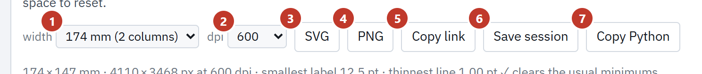

1. **width.** The printed width: 85 mm (1 column), 174 mm (2 columns, the default), 120 mm, 240 mm (slide).
2. **dpi.** 300, 600 (default) or 1200, for PNG.
3. **SVG.** A vector figure sized in millimetres, **with this session inside it**: dropping the SVG
   back onto the page reopens exactly this figure.
4. **PNG.**
5. **Copy link.** A link that reopens this exact figure (the session is in the part of the address
   after `#s=`).
6. **Save session.** The whole session as a file you can reopen or send (`.thetascene.json`).
7. **Copy Python.** The DescriPyTor calls that reproduce the numbers, with assertions
   ([section 12](#12-checking-the-numbers)).

**Several panels in one figure.** In the **Sheet** section, build the figure you want, press **+ Add
this figure**, then change the molecule or the view and add the next. In the panels list, ▲ ▼ reorder
them, *open* loads one back into the page, and × removes it.

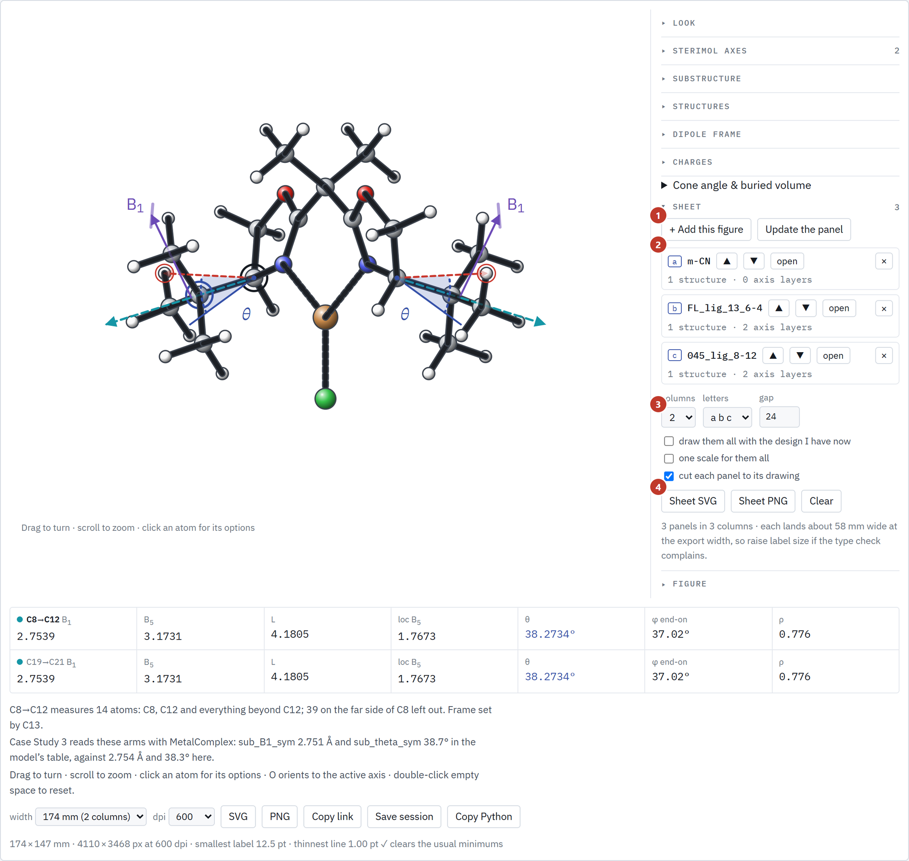

1. **+ Add this figure.** Keeps the whole current figure as a panel (**Update the panel** overwrites the
   panel it came from).
2. **The panels.** Each keeps its own structures, layers, view and design.
3. **columns, letters, gap.** 1–4 columns; panel letters *a b c*, *A B C* or none.
4. **Sheet SVG / Sheet PNG.** Export the whole sheet. The three checkboxes above them say whether to
   draw every panel with the design you have now, to hold one scale for all, and to cut each panel to
   its drawing.

The page tells you how wide each panel lands, for example *"3 panels in 3 columns · each lands about
58 mm wide at the export width"*; raise the label size if the type check complains.

**Scripted exports.** The URL can build a figure with no clicking, which is how the paper's figures are
made. Adding `&figure=1` strips the page down to the exported figure:

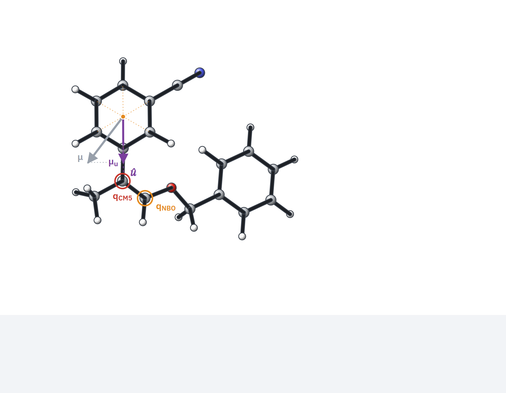

Several panels at once: `?sheet=m-CN::Case Study 1;FL_lig_13::Case Study 2&cols=2&figure=1`. A full
list of parameters is in [section 14](#14-keyboard-mouse-and-url-reference).

## 11. Your own molecules

**Open files** (or drag the files onto the picture) accepts:

| file | gives |
|---|---|
| `.xyz` (a multi-frame xyz becomes one structure per frame), `.sdf` | the geometry |
| `.feather` from `descripytor logs_to_feather`, or a Gaussian `.log` | the geometry **plus the dipole and the charges**, read by the package |
| `.thetascene.json`, or an SVG the explorer exported | the whole session it was saved from |

The `.feather` and `.log` routes need the Flask server (`descripytor visual`), because the package
reads those files.

**Paste coordinates** takes an xyz block directly: the atom count, a comment line, then one atom per
line.

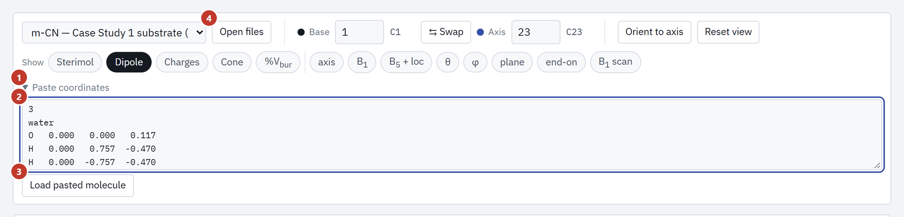

1. Open **Paste coordinates**.
2. Paste an xyz block (the box shows an example).
3. Press **Load pasted molecule**.
4. **Open files** is the same thing for files.

After loading, set Base and Axis and choose what to show. The first line of the readout tells you
what was measured; check that the fragment is the one you meant.

**Tip.** Use the same atom numbering across a series, or use the Substructure search to place the axis
on the same fragment in each molecule. Atoms in different numbering are the usual cause of a stack that
will not align.

## 12. Checking the numbers

The explorer's Sterimol is a line-for-line port of the package's, and it is gated against the Python
(`M2_data_extractor/theta_explorer/gate.js`, `smoke.js` and the scripts described in
[WORKFLOW.md §9](WORKFLOW.md#9-running-the-tests)). There are two ways to check a number yourself.

**Live, when served by the package.** With `descripytor visual`, every time you pick an axis the page
sends the coordinates to the package and compares five values: B₁, B₅, L, loc B₅ and θ. The line under
the numbers says *"✓ DescriPyTor's Python gives the same five values (checked live)."*, or names the
value that differs.

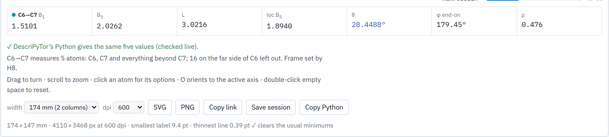

φ end-on and ρ are not part of this check. The explorer's φ is not numerically the package's
`B1_B5_azimuth` column (for `FL_lig_13` C6→C7: 179.45° against 179.72°).

**Copy Python.** Press **Copy Python** for the calls that reproduce the numbers on the current
structure and axis. For `FL_lig_13`, axis C6→C7, it gives:

```python
import pandas as pd
import data_extractor as de                       # MolFeatures/M2_data_extractor

xyz = pd.read_csv('FL_lig_13.xyz', sep=r'\s+', skiprows=2, names=['atom', 'x', 'y', 'z'])
bonds = de.extract_connectivity(xyz)             # threshold_distance=1.82 gives the pre-2026-09-27 bonds

r = de.get_sterimol_df(xyz, bonds, [6, 7], None, radii='CPK').iloc[0]   # C6→C7
assert [round(float(r[k]), 4) for k in ('B1', 'B5', 'L', 'loc_B5', 'B1_B5_angle')] == [1.5101, 2.0262, 3.0216, 1.894, 28.4488]
```

The first import line is for a source checkout. With the package installed, use
`from M2_data_extractor import data_extractor as de`. With that import and the fixture
`M2_data_extractor/theta_explorer/fixtures/FL_lig_13_str_target.xyz`, the assertion holds under
DescriPyTor 0.2.1.

## 13. Known differences from the package

**The explorer's bond rule is still the flat 1.82 Å cutoff (open, as of 2026-10-03).**
DescriPyTor 0.2.0 changed the package's bond rule to 1.15 × the sum of covalent radii, which keeps
S–CF₃ and P–C bonds that are longer than 1.82 Å. The page still bonds at 1.82 Å, unless a structure
sets its own cutoff. For most molecules the two rules give the same bonds. Where they differ, Sterimol
fragments through the long bond differ, and so do the numbers.

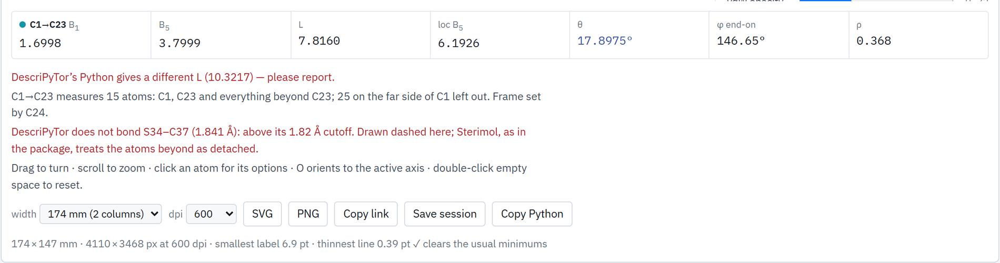

The page draws such a bond dashed and says so in red, and, when served by `descripytor visual`, the
live check reports the difference (*"gives a different L (10.3217)"*). B₁, B₅, loc B₅ and θ agree for
p-OTf; only L differs. The consequence for you:

- Numbers for a molecule with a long single bond (a triflate, a phosphine carbon) can differ from the
  package's. The Copy Python assertion fails for p-OTf under 0.2.1 (L 7.8160 against 10.3217).
- The old rule is the one the paper's tables were built with (tag `paper-v3`); the package reproduces
  them inside `with descripytor.compat.paper_v3():`.
- Until the explorer's default is changed, take numbers you will publish from the package, and use the
  explorer to see the construction.

**Metal-complex arms.** The Case Study 3 numbers in the paper's tables were produced by
`MetalComplex`, which measures each arm in its own frame and fragment, so they differ slightly from the
page's: by a few thousandths of an Å and a few tenths of a degree. The page prints both for `045_lig`
(*sub_B1_sym 2.751 Å and sub_theta_sym 38.7° in the model's table, against 2.754 Å and 38.3° here*).

**B₁ resolution.** B₁ is a minimum that usually sits on a kink where two atoms tie, so it is good to
about ±0.01 Å. θ at a flat minimum can move by tens of degrees; the B₁ scan ([section 7](#7-the-b1-scan))
shows when that is the case.

## 14. Keyboard, mouse and URL reference

**Mouse**

| action | does |
|---|---|
| drag | turn the molecule |
| scroll | zoom |
| click an atom | open its menu |
| double-click empty space | reset the view |
| drop files on the picture | load them |

**Keys**

| key | does |
|---|---|
| **S** | swap base and axis |
| **R** | reset the view |
| **O** | orient to the active axis |
| **B** / **A** | with an atom's menu open: make it the base / the axis |
| arrow keys | turn the molecule in 5° steps (when no box has focus) |
| **Esc** | close the menu, or leave the brush |

**URL parameters** (for `theta_explorer.html` and `/theta`)

| parameter | value | does |
|---|---|---|
| `mol` | a molecule name, such as `FL_lig_13` | opens that structure |
| `preset` | a number, or the start of a preset's name | applies that paper preset |
| `style` | `key:value,key:value` | overrides look settings for this render |
| `figure` | `1` | strips the page to the exported figure |
| `sheet` | `mol::preset;mol::preset` | builds a sheet from those presets |
| `cols`, `letters`, `gap`, `tight` | numbers or flags | sheet layout |
| `#s=` | a base64 session | opens a saved session (what **Copy link** gives you) |

## 15. Regenerating the screenshots

The pictures in this manual are made by a script, so they can be redone when the page changes:

```bash
pip install playwright pillow          # Chrome is used from the machine
python docs/images/theta_explorer/make_images.py            # all of them
python docs/images/theta_explorer/make_images.py anatomy    # one
```

It serves the explorer on a free port, drives it, adds the numbered callouts at the real element
positions, and writes the PNGs next to the script. The numbering of the callouts is the numbering of
the lists in this manual; change both together. `live_check` also starts `descripytor visual` for the
two live-check pictures.
