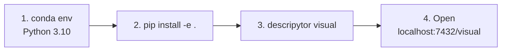
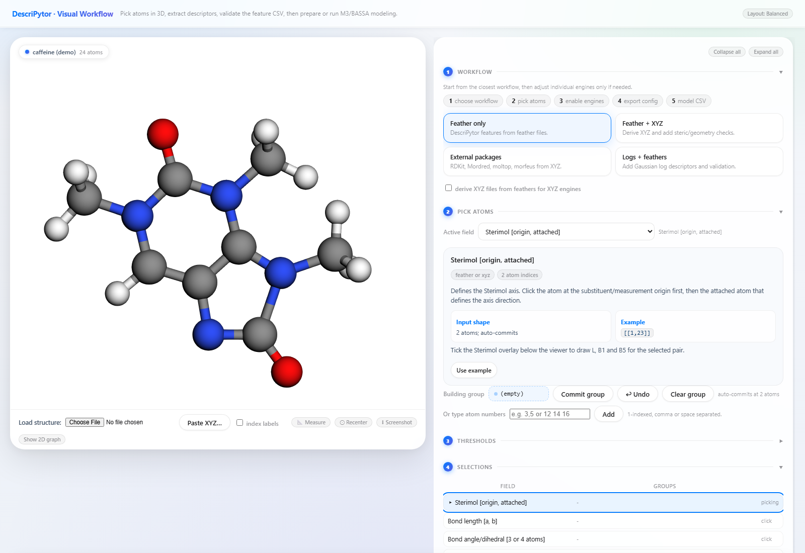
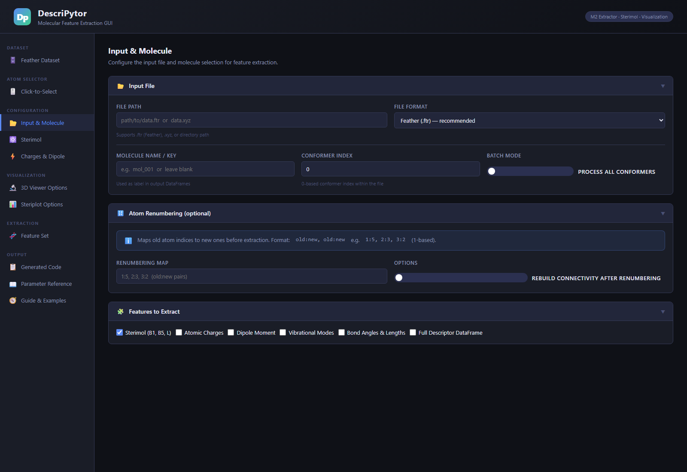
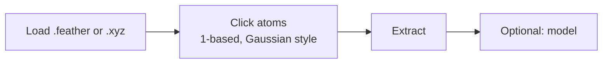

# DescriPyTor — visual start

Start with **conda + pip**. Open one local URL. Use Docker only if that fails, or you need xTB / extra engines.

A printable page lives next to this file: [visual-guide.html](visual-guide.html) (open in a browser → Ctrl+P → Save as PDF).

---

## Install



```bash
git clone https://github.com/Milo-group/DescriPyTor.git
cd DescriPyTor
conda create -n descripytor python=3.10
conda activate descripytor
pip install -e .
descripytor visual
```

Then open http://localhost:7432/visual

If RDKit or igraph fail: `conda install -c conda-forge rdkit python-igraph`

---

## What you will see

| What | Open |
|---|---|
| 3D atom picker (start here) | http://localhost:7432/visual |
| Feature extraction GUI | http://localhost:7432/ |

**3D atom picker** — caffeine loads as a demo. Click atoms on the left; set the workflow and fields on the right. Load your own file with **Choose File**.



**Feature GUI** — same engine, form-based, if you already know the atom indices.



---

## In the picker



Example molecules (26 substituted benzenes) ship with the package. Gaussian `.log` files: convert first with `descripytor logs_to_feather`.

---

## If something fails

| What you see | What to do |
|---|---|
| RDKit / igraph / Morfeus import errors | `conda install -c conda-forge rdkit python-igraph`, then Docker below |
| Port 7432 already in use | Close the other app using that port |

---

## Docker (last resort / full toolkit)

Use this if conda still fails, or you need Streamlit, xTB, and the extra engines. Install [Docker Desktop](https://www.docker.com/products/docker-desktop/), wait until the engine is running, then from the clone:

```bash
mkdir work
docker compose up --build
```

First build takes several minutes. Leave that terminal open.

| What | Open |
|---|---|
| 3D atom picker | http://localhost:7432/visual |
| Feature extraction GUI | http://localhost:7432/ |
| Streamlit extraction app | http://localhost:8503 |

Drop `.feather`, `.xyz`, or CSV into `work/` on your computer. In the GUI, type `/work/yourfile.feather`. Results written to `/work` show up in that same folder.

Stop: `Ctrl+C`, or `docker compose down`.

Longer notes: [QUICKSTART.md](../QUICKSTART.md) · [README.md](../README.md)
