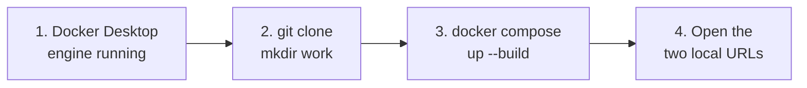
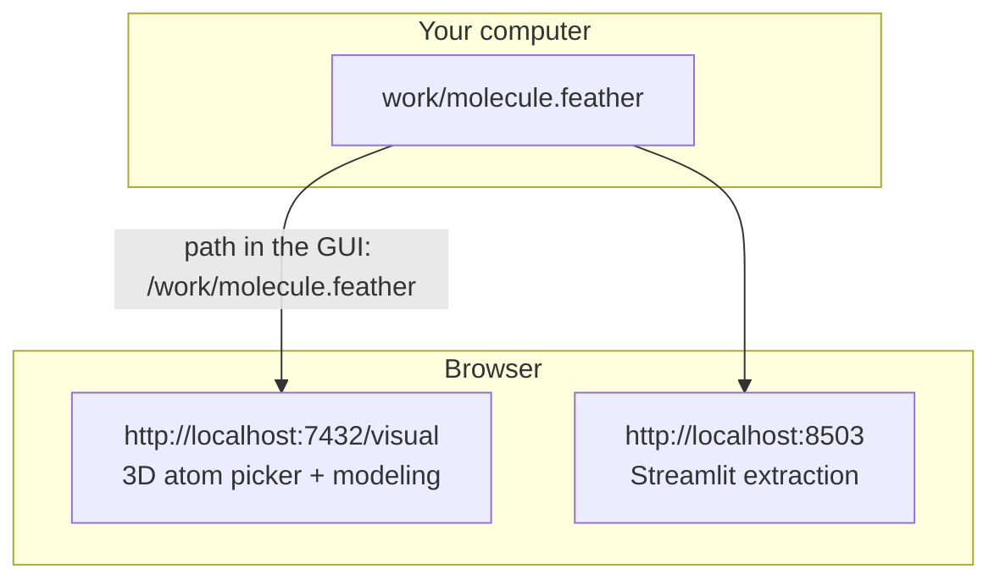
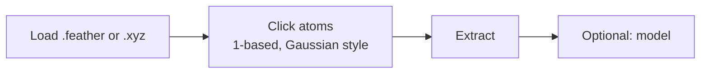

# DescriPyTor — visual start

Use **Docker**. Chemistry software is already in the image. Four steps, then two links in the browser.

A printable page lives next to this file: [visual-guide.html](visual-guide.html) (open in a browser → Ctrl+P → Save as PDF).

---

## Install



```bash
git clone https://github.com/Milo-group/DescriPyTor.git
cd DescriPyTor
mkdir work
docker compose up --build
```

First build takes several minutes. Leave that terminal open.

---

## Open these two pages



| What | Open |
|---|---|
| 3D atom picker + modeling | http://localhost:7432/visual |
| Streamlit extraction app | http://localhost:8503 |

Drop `.feather`, `.xyz`, or CSV into `work/` on your computer. In the GUI, type `/work/yourfile.feather`. Results written to `/work` show up in that same folder.

Stop: `Ctrl+C`, or `docker compose down`.

---

## In the picker



Example molecules (26 substituted benzenes) ship with the package. Gaussian `.log` files: convert first with `descripytor logs_to_feather`.

---

## If something fails

| What you see | What to do |
|---|---|
| Cannot connect to Docker | Start Docker Desktop and wait until it is idle |
| Port 7432 or 8503 already in use | Close the other app using that port |
| RDKit / Morfeus errors on pip | Use Docker instead |

---

## Without Docker (conda already set up)

```bash
conda create -n descripytor python=3.10
conda activate descripytor
pip install "descripytor[gui,webapp]"
descripytor gui
```

That last command opens the desktop window. For the same browser picker as Docker, clone the repo and run:

```bash
python M2_data_extractor/gui_server.py
```

Then open http://localhost:7432/visual

Longer notes: [QUICKSTART.md](../QUICKSTART.md) · [README.md](../README.md)
